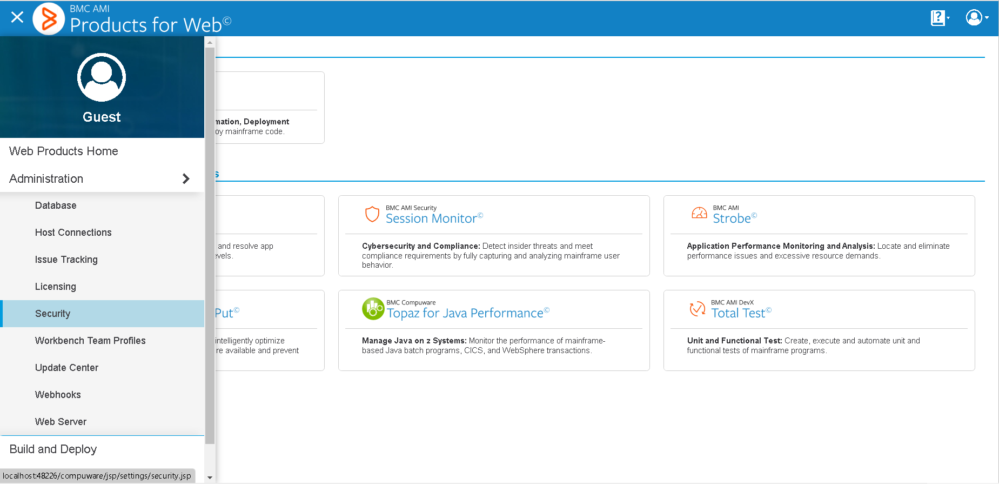

# code-pipeline-build

The code-pipeline-build action allows your GitHub Actions workflow to trigger a build in your instance of BMC AMI DevX Workbench Code Pipeline on the mainframe. This action can be used in scenarios where your mainframe source is stored in git, or when you want your GitHub Actions workflow to operate on source that is already stored in Code Pipeline.

## Example usage

The following example will automatically retrieve the build parameters from a previous sync step in the job

``` yaml
on: [push]

jobs:
  run-code-pipeline-build:
    runs-on: [self-hosted, ubuntu-ispw]
    name: A job to sync git source into Code Pipeline, then build it on the mainframe
    steps:
      - name: Sync step
        uses: bmc-compuware/ispw-sync@v1
        id: sync
        with:
          host: 'host.example.com'
          port: 37733
          uid: ${{ secrets.TSOUSER }}
          pass: ${{ secrets.TSOPASS }}
          runtimeConfiguration: 'ISPW'
          stream: 'PLAY'
          application: 'PLAY'
          checkoutLevel: 'DEV2'
          gitUid: 'admin'
          gitToken: ${{ secrets.GITHUB_TOKEN }}
          showEnv: true
      - name: Build
        uses: bmc-compuware/ispw-build@v1
        id: build
        with:
          ces_url: 'https://CES:48226/'
          ces_token: ${{ secrets.CES_TOKEN }}
          srid: 'host-37733'
          runtime_configuration: 'ISPW'
          build_automatically: ${{ steps.sync.outputs.automaticBuildJson }}
      - name: Get the number of generate failures
        run: echo "The number of generate failures is ${{ steps.build.outputs.generate_failed_count }}"
```

The following example will generate two specific Code Pipeline tasks 

``` yaml
on: [push]

jobs:
  run-code-pipeline-build:
    runs-on: [self-hosted, ubuntu-ispw]
    name: A job to build source in Code Pipeline
    steps:
      - name: Build
        uses: bmc-compuware/ispw-build@v1
        id: build
        with:
          ces_url: "https://CES:48226/"
          ces_token: ${{ secrets.CES_TOKEN }}
          srid: host-37733
          runtime_configuration: ISPW
          task_id: "7E3A5B274D24,7E3A5B274EFA"
      - name: Get the set ID for the build
        run: echo "The Code Pipeline set used for the build is ${{ steps.build.outputs.set_id }}"
```

## Inputs

| Input name | Required | Description |
| ---------- | -------- | ----------- |
| `ces_url` | Required | The URL to use when connecting to CES |
| `ces_token` | Required | The token to use when authenticating the request to CES |
| `srid` | Required | The SRID of the Code Pipeline instance to connect to |
| `change_type` | Optional | The change type of this request. The default value is 'S' for standard. |
| `execution_status` | Optional | The flag to indicate whether the build should happen immediately, or should be held. The default is 'I' for immediate. Other possible value is 'H' for hold. |
| `runtime_configuration` | Optional | The runtime configuration for the instance of Code Pipeline you are connecting to. |
| `build_automatically` | Optional | A string of JSON that contains the parameters for the build. If using an code-pipeline-sync or code-pipeline-sync-local step before the build, this JSON string can be retrieved from the outputs of that step. If `build_automatically` is not being used, then the task_id must be specified. |
| `task_id` | Optional | The comma-separated string of task IDs for the tasks that need to be built. Do not use if `build_automatically` has already been specified.|

## Outputs

| Output name | Output type | Description |
| ----------- | ----------- | ----------- |
| `generate_failed_count` | number | The number of tasks that failed to generate. |
| `generate_success_count` | number | The number of tasks that generated successfully. |
| `is_timed_out` | boolean | Whether the build timed out. A time out would indicate that the build has not completed and may still be running. |
| `has_failures` | boolean | Whether there were any build failures. |
| `task_count` | number | The total number of tasks a build was initiated against. |
| `set_id` | string | The ID of the set that was used for processing. |
| `url` | string | The URL that can be used to retrieved information about the set that was used for processing. |
| `assignment_id` | string | The assignment ID that can be used to retrieved information about the assignment that was used for processing. |
| `output_json` | JSON | the JSON output from build |

## Setup

### Create a token in CES

In order to use this action, you must have an instance of the BMC AMI Common Enterprise Services (Common Enterprise Services) product installed on one of your runners. Once that is complete, you will need to open CES in your web browser and create a token to be used during CES requests. To set up a new host connection, go to the hamburger menu in the upper left corner and select Host Connections.



On the Host Connection Settings page, click "Add." Set up the host connection to be used for Code Pipeline and click OK when finished.

Then, go back to the menu and select Security. On the Security page, click Add and the Personal Access Token dialog will come up.


On the Personal Access Token dialog, select the host that you want to create a token for, and enter in the mainframe username and password.

Once done, there will be a new token in the table on the Security page


### Save the token as a GitHub Secret

From the Security page in CES, copy the token. In GitHub go to Settings > Secrets and click the button for New Repository Secret.


On the New Secret page, paste the token that was copied earlier and click the Add secret button. Make a note of the name you give the secret so that you can easily use it in your workflow script.


### Fill in the workflow script

Use the examples above to fill in a workflow script using the code-pipeline-build action. Note that if you want taskIds to be automatically picked up from the Code Pipeline synchronization with Git, you will need a synchronization step in you job, which will run before the build.

### Troubleshooting

To enable debug logging in your GitHub actions workflow, see the guide [here](https://docs.github.com/en/actions/managing-workflow-runs/enabling-debug-logging).

### Developers

For information about contributing to the code-pipeline-build action, see [Developing on the code-pipeline-build GitHub action](./CONTRIBUTING.md)

## See also
- [License](LICENSE.txt)